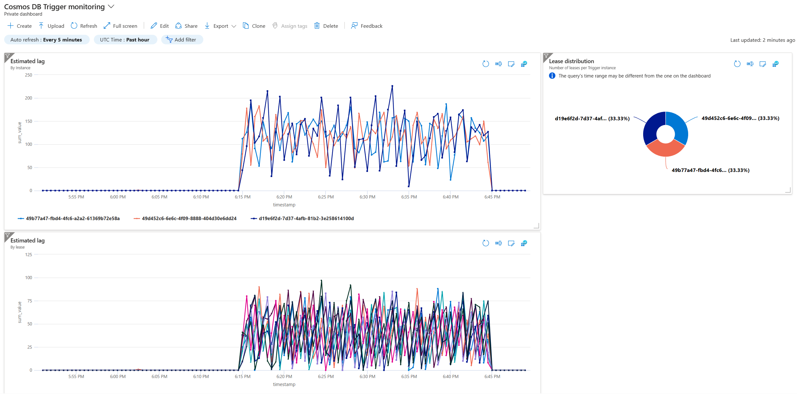

# Azure Cosmos DB + Azure Functions: Estimating pending lag - Azure Dev .NET Days

<TBD recording>

## Description

This repository contains the code reference to help create an Azure Dashboard to track the pending work on a deployed `CosmosDBTrigger`. The theme is a system that processes device telemetry and produces a real time summary as telemetry is stored in an Azure Cosmos DB container.

It contains three projects:

1. [cosmos.trigger](./cosmos.trigger/): A `CosmosDBTrigger` with [retry policy](https://learn.microsoft.com/azure/azure-functions/functions-bindings-error-pages#retry-strategies) support, that generates a summary per device and stores it on another Cosmos DB container.
1. [cosmos.monitor](./cosmos.monitor/): A `TimerTrigger` that will leverage the [Change Feed Estimator](https://docs.microsoft.com/azure/cosmos-db/sql/how-to-use-change-feed-estimator#as-an-on-demand-detailed-estimation), obtain lag estimations across leases, and report it as Metrics on Application Insights.
1. [cosmos.writer](/cosmos.writer/): A console application that can [simulate](#generating-traffic) telemetry data for the Trigger.

The code in this repository can be used as a complete solution or referenced as individual components.

## Prerequisites

This solution requires provisioning the following resources:

1. Azure Cosmos DB Account with a database and three containers: one for telemetry, another for the summary, and a last one for the leases (named "leases"). The containers must have the following partition keys:
    1. `/id` for the telemetry container.
    1. `/DeviceId` for the summary container.
    1. `/id` for the leases container.
1. Two Azure Function Apps, one for the `cosmos.trigger` project and another for `cosmos.monitor` project, each with it's own Application Insights instance.

The Function Apps must have the following [settings](https://learn.microsoft.com/azure/azure-functions/functions-how-to-use-azure-function-app-settings?tabs=portal#settings):

1. `cosmosConnection` should either contain the connection string or have the `accountEndpoint` and `credential` set accordingly to use Managed Identities. For the latter, the Managed Identity should be provisioned and [granted permissions](https://learn.microsoft.com/azure/cosmos-db/how-to-setup-rbac#using-the-azure-cli-1). For more details see the [trigger documentation](https://learn.microsoft.com/azure/azure-functions/functions-bindings-cosmosdb-v2-trigger?tabs=in-process%2Cextensionv4&pivots=programming-language-csharp#identity-based-connections).
1. `EVENTCONTAINER` should contain the name of the container for the telemetry data.
1. `SUMMARYCONTAINER` should contain the name of the container for summary data.
1. `REGION` is optional and ideally contains the name of the Azure Region to leverage reading and writing data to a preferred Cosmos DB region.

## Using the Change Feed Estimator

THe highlight of this repository is the [cosmos.monitor TimerTrigger](./cosmos.monitor/CosmosMonitor.cs). It showcases the way that you can leverage the `CosmosClient` instance that is configured using the `cosmosConnection` to create a [Change Feed Estimator](https://docs.microsoft.com/azure/cosmos-db/sql/how-to-use-change-feed-estimator#as-an-on-demand-detailed-estimation) and obtain the estimated lag on each lease, including the identifier of the owner. You can use this information to produce a [dashboard](#importing-dashboard) and visualize or even create alerts when the lag goes beyond certain thresholds.

The following code creates an Estimator using the provided `CosmosClient` and referencing the [Change Feed Processor](https://docs.microsoft.com/azure/cosmos-db/sql/change-feed-processor) configuration that the `CosmosDBTrigger` is wiring:

```csharp
var leaseContainer = cosmosClient.GetContainer(Environment.GetEnvironmentVariable("DATABASE"), "leases");
var monitoredContainer = cosmosClient.GetContainer(Environment.GetEnvironmentVariable("DATABASE"), Environment.GetEnvironmentVariable("EVENTCONTAINER"));
this.estimator ??= monitoredContainer.GetChangeFeedEstimator("EventProcessor", leaseContainer);
```

It references the monitored container and the leases container, using the Function App settings value and **uses a `processorName` that matches the `CosmosDBTrigger.LeaseContainerPrefix`**.

The estimation results are then sent as Metrics to Application Insights with extended properties (Lease identifier and Owner):

```csharp
log.LogMetric($"Estimation Lease {item.LeaseToken}", item.EstimatedLag, 
    new Dictionary<string, object>() { 
        { "Lease", item.LeaseToken }, 
        { "Owner", item.InstanceName } });
```

## Generating traffic

The project on `cosmos.writer` can be used to generate a simulated load on the `CosmosDBTrigger` monitored container from the command-line:

```bash
dotnet run --connectionString "<cosmos DB connection string>" --concurrency 5 --devices 100000 --db <database name> --container <telemetry container name> --time PT30M
```

The `concurrency` parameter can be customized to increase or decrease the volume of concurrent operations based on the provisioned RU/s on the monitored container, while the `time` parameter can be used to control the duration of the simulation using ISO 8601 format.

## Importing dashboard

This repository contains a [sample dashboard](./dashboard/Cosmos_DB_Trigger_monitoring.json) that can be imported on Application Insights to visualize the estimated lag on the monitored container. Before importing the dashboard, you must update the Resource Ids:

`"/subscriptions/{your-subscription-id}/resourceGroups/{resource-group}/providers/microsoft.insights/components/{appinsights-name}"`

1. `{your-subscription-id}`: The subscription Id of the Application Insights instance.
1. `{resource-group}`: The resource group of the Application Insights instance.
1. `{appinsights-name}`: The name of the Application Insights instance.


